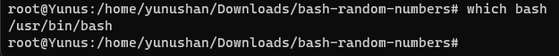
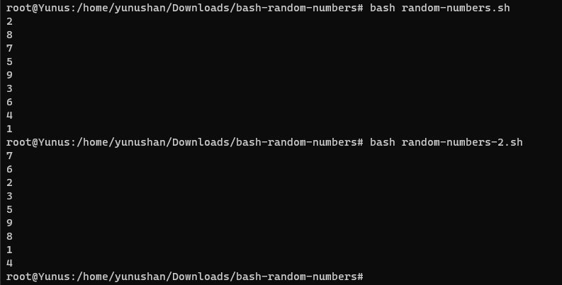

# bash-random-numbers

## Build instructions
Bash program needs to be pre-installed in your linux,you can verify that with `which bash` command.

## Usage

You can execute shell script with `./random-numbers.sh` or `./random-numbers-2.sh` commands as shown below.

Or you can execute shell script with `bash random-numbers.sh` or `bash random-numbers-2.sh` commands as shown below.

## Description
For the purpose of generating random numbers between 1-10 in bash script

## Known limitations / bugs

No known limitations or bugs.
